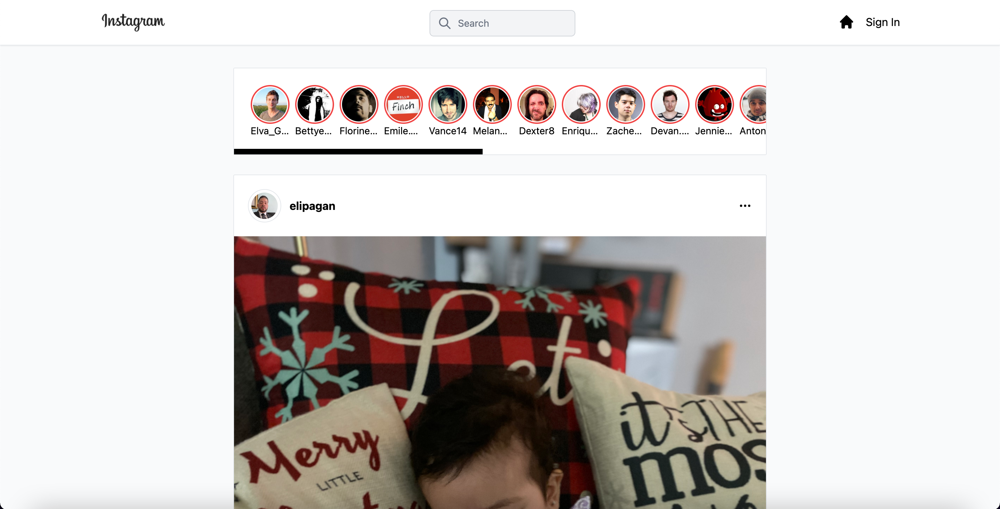

# TheGram_2

## Description
A clone website of instagram, where you are able to post, like and comment. 

## Technologies Used
* React
* Next.js
* JavaScript
* Tailwind CS

## Preview 

## Next.js + Tailwind CSS Example

This example shows how to use [Tailwind CSS](https://tailwindcss.com/) [(v3.0)](https://tailwindcss.com/blog/tailwindcss-v3) with Next.js. It follows the steps outlined in the official [Tailwind docs](https://tailwindcss.com/docs/guides/nextjs).

## How to use

* Download https://github.com/EliP2389/thegram_2.git to local device
* npm run dev to start server 
* run http://localhost:3000/ in browser